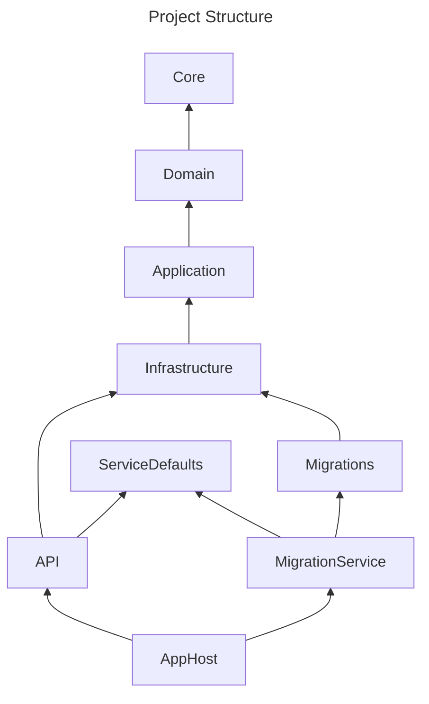

# Crafters Cloud Reference Architecture

  [](https://www.nuget.org/packages/CraftersCloud.ReferenceArchitecture.ProjectTemplates)  [](https://www.nuget.org/packages/CraftersCloud.ReferenceArchitecture.ProjectTemplates)  [](https://myget.org/gallery/crafters-cloud)

## Overview

This project provides a reference for building scalable, high-performing, and maintainable applications using C#, SQL (SQL Server), and Distributed Cache (Redis).  

It includes a set of Visual Studio project templates, published as a NuGet package, which can scaffold an entire solution with all the projects pre-configured via `dotnet new crafters-starter`, or scaffold a new feature using `dotnet new crafters-feature`.

The architecture leverages several modern technologies and best practices to ensure high performance, maintainability, and ease of development. It is based on the principles of Domain-Driven Design (DDD), CQRS, and [Vertical Slice Architecture](https://www.jimmybogard.com/vertical-slice-architecture/).

Primarily designed to be flexible and extensible, the architecture allows developers to quickly create new features (vertical slices) paired with corresponding integration tests (black-box tests that cover entire verticals). It does not prioritize either [Onion Architecture](https://medium.com/@alessandro.traversi/understanding-onion-architecture-an-example-folder-structure-9c62208cc97d) or [Clean Architecture](https://celepbeyza.medium.com/introduction-to-clean-architecture-acf25ffe0310), but both can be supported **if** and **when** more complex cases arise.

## Usage

### Prerequisites

- .NET SDK 9
- Aspire SDK
- Docker

### Getting Started

#### Either:
1. **Clone the Git repository**

   ```bash
    git clone https://github.com/crafters-cloud/crafters-cloud-reference-architecture.git
   ```

#### Or:

1. **Install the Project Templates from NuGet**
   ```bash
   dotnet new install CraftersCloud.ReferenceArchitecture.ProjectTemplates
   ```

2. **Create a New Solution**
    Replace _Client.Project_ and _Client Project_ with the name of your new project.
   ```bash
   dotnet new crafters-starter --projectName Client.Project --friendlyName "Client Project" --allow-scripts yes
   ```
3. **Run new Solution and Verify**  
   - Start the Docker.
   - Open the new solution in Visual Studio or Rider.  
   - Build the solution and run tests.

4. **Scaffold a New Feature**  
   - Either run the script `scripts\new-feature.ps1` or
   - execute:
   ```bash
   dotnet new crafters-feature --projectName Client.Project --featureName Order --featureNamePlural Orders --allow-scripts yes
   ```

## Solution Structure

The solution consists of a set of pre-configured and connected projects, grouped in three solution folders: _src_, _templates_, and _tests_.

### _src_ folder
Contains the following projects:


- **_Core_**: Root project upon which all other projects depend. It should remain lightweight, containing only non-business-related code.
- **_Domain_**: Contains the business rules (Domain Entities, Value Objects, Domain Services, Domain Validation rules/invariants).
- **_Application_**: Business use case layer where [Application Services](https://enterprisecraftsmanship.com/posts/domain-vs-application-services/) or Query/Command Handlers are implemented.
- **_Infrastructure_**: For "dirty" infrastructure-related code, such as API client implementations, Service Bus integrations, database provider implementations, logging, IoC container bootstrapping, cache implementations, etc.
- **_Migrations_**: Contains database migration and seeding definitions.
- **_MigrationService_**: A worker project for automatic database migrations, in combination with Aspire Host.
- **_AppHost_**: Startup project to initialize dependent resources (e.g., SQL, Redis, API) using Microsoft Aspire.
- **_Api_**: "Presentation" layer.
- **_ServiceDefaults_**: Aspire Shared project.

### _templates_ folder
Contains project templates:

- **Feature**: Template for adding a new feature.
- **Solution**: Template for creating a new solution.

### _tests_ folder
Contains the following test projects:

- **_Api.Tests_**: Tests for the Api project.
- **_AppHost.Tests_**: Tests for the AppHost project.
- **_Domain.Tests_**: Tests for the Domain layer.
- **_Infrastructure.Tests_**: Tests for the Infrastructure layer.
- **_Tests.Shared_**: Shared code for test projects.

## Domain (and Entities)

All business rules should be defined in the Domain project. Other projects should re-use the business rules located in the Domain as much as possible. These business rules are defined through a set of classes: Entity, Value Object, Domain Events, Validation Rules, Business Rules, and extension methods on the domain classes.

- **Entity** - an object defined primarily by its ID, and not by its properties:
    - An _Entity_ is any class that inherits (directly or indirectly) from the `Entity` abstract class.
    - An _Entity_ class (as defined in this architecture, which knowingly deviates slightly from pure DDD) serves two purposes:
        - It is used for mapping between a database table and a class (ORM mapping).
        - It encapsulates business rules to ensure domain invariants.
    - An _Entity_ class should be designed to prevent invalid domain states (adhering to the [Always-Valid Domain Model Approach](https://enterprisecraftsmanship.com/posts/always-valid-domain-model/)) and disallow updates without raising domain events (critical for event dispatching). This is achieved by:
        - Making all setters private.
        - Exposing collections as readonly collections.
        - Allowing data updates only through **explicitly** defined public methods (to ensure that business rules are not violated and domain events are raised).
        - Making public methods internally raise domain events (private methods typically do not need to raise them, as they are invoked by public methods).
        - Making the default constructor private (used only by EF Core).
        - Providing public factory methods for creating entities in a valid state.
        - Using the [Execute/CanExecute](https://enterprisecraftsmanship.com/posts/validation-and-ddd#_solution_4_execute_canexecute_pattern) pattern for public methods requiring complex business rule validation:
            - `CanExecute` returns results (consuming code checks the result and only calls `Execute` if valid; otherwise, errors are propagated to the calling code).
            - `Execute` throws exceptions.

- **Value Object** - an immutable type defined by its properties rather than a unique identity. C# "Records" are ideal for Value Objects. They are mainly used for Entity IDs but can also represent other concepts like names, emails, etc. Value Objects must:
    - Be immutable.
    - Be comparable based on their properties.
    - Always be valid (Value Objects should prevent creation in an invalid state).
    - Not have individual identity.

- **Domain Event** - a set of classes that communicate changes occurring in an entity to its event subscribers, following the Publish/Subscribe pattern.
    - Domain events are stored in the entity instance using the `AddDomainEvent` method.
    - Domain events are collected and published **after** calling `SaveChanges` on the Entity Framework DbContext, but **before** the database transaction is committed. This allows additional changes to be made as part of the same transaction (e.g., adding integration events to the database).

- **QueryableExtension** - a set of classes that extend the `IQueryable<ConcreteEntity>` interface, providing a simple implementation of the Specification pattern.
    - Instead of creating methods within `IRepository<ConcreteEntity>`, it is more flexible to use extension methods on `IQueryable<ConcreteEntity>` so that different queries can be chained or combined.

- **EnumerableExtension** - a set of classes that extend the `IEnumerable<ConcreteEntity>` interface.
    - Filter expressions that cannot be translated by the concrete `Queryable` provider (e.g., Entity Framework) should be placed here. However, if they **can** be translated, they should belong to `QueryableExtensions` instead.

- **Validations** - a set of classes that contain validation rules that can be used by either the entity (to validate itself) or by other layers (e.g. API for Request validation, Application for Command/Query validation). With the combination of **Always-Valid Domain Model Approach** the set of rules should remain simple.

## Testing Strategy

Following the principles of Black Box testing, XP (eXtreme Programming), and YAGNI (You Aren't Gonna Need It), the focus is to **first** write integration tests that cover each feature
(e.g., in the case of an API, testing every API endpoint) and cover a happy-flow path. These tests require minimal setup (no fakes, mocks, or stubs) but only database data seeding.  
Later, as the code complexity grows in the domain area (business rules), it is recommended to write unit tests for the domain. With this combination of unit and integration tests, we should achieve a [Testing Diamond](https://ritesh-kapoor.medium.com/testing-automation-what-are-pyramids-and-diamonds-67494fec7c55) structure,
where the optimum number of tests is needed to achieve optimum test coverage.

The tests adhere to Black Box testing principles of API endpoints. This approach allows the implementation and architecture of the system to evolve without requiring test updates.

White-box testing (using fakes and mocks) is still possible but is generally considered a code smell for the majority of tests. It can hinder code evolution and architectural changes, as both the implementation and the tests would require updates in tandem.

To verify test results effectively, the libraries [VerifyTests](https://github.com/VerifyTests/Verify) and [Shouldly](https://docs.shouldly.org/) are used, providing a more readable way of validating outcomes.

With this strategy, developers are encouraged and eager to write and maintain tests. The refactoring of both the architecture and the code over time ensures technical debt is kept under control.  
Arbitrary decisions regarding test coverage (e.g., endpoints, services, domain entities) are avoided, reducing team ambiguity and friction while simplifying pull requests.

Unit tests should be written for complex business rules. However, given that this is just a sample project and there are no complex business rules, it does not include a good example of a unit test.

## Key Technologies

- [Minimal API](https://learn.microsoft.com/en-us/aspnet/core/fundamentals/minimal-apis/overview?view=aspnetcore-9.0): A lightweight, efficient framework for building RESTful services.
- [Autofac](https://autofac.org/): A popular IoC container for managing application dependencies.
- [Entity Framework](https://learn.microsoft.com/en-us/ef/core/): An O/RM enabling database operations via .NET objects.
- [MediatR](https://github.com/jbogard/MediatR): Simplifies decoupling of requests and handlers.
- [Mapperly](https://mapperly.riok.app): A fast object-to-object mapper for transforming objects between layers.
- [FluentValidation](https://docs.fluentvalidation.net/en/latest/): Strongly typed model validation rules.
- [NUnit](https://nunit.org/): A flexible unit testing framework for .NET.
- [TestContainers](https://testcontainers.com/): An open source library for providing throwaway, lightweight instances of databases, message brokers, web browsers, or just about anything that can run in a Docker container.
- [Microsoft Aspire](https://learn.microsoft.com/en-us/dotnet/aspire/get-started/aspire-overview): A set of tools, templates, and packages for building observable, production ready apps.

Together, these technologies create a strong foundation for developing modern, high-quality applications.

## How-tos

- [Scaffold a new feature](./documentation/how-tos/how-to-scaffold-a-new-feature.md).
- [Adding property/column to an entity/table](./documentation/how-tos/how-to-add-new-property-to-an-entity.md)
- Builder pattern (TODO).
- Seeding  (TODO).
- How to decide when to put logic in the Endpoints or to use Query/Commands  (TODO). 